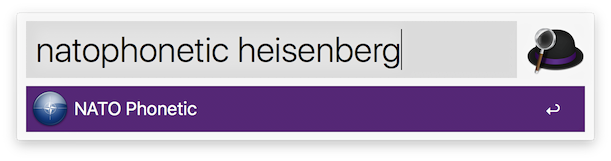
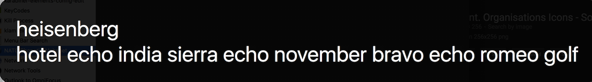

# alfred-workflows
Workflows for Alfred OS X app launcher

## [NATO Phonetic Alphabet](NATOPhoneticAlphabet)
Convert text to NATO Phonetic Alphabet
for more accurate voice transmission (on the phone, etc.)

Uses [`nato.py` from Stephen Brown](https://github.com/StephenBrown3/nato.py)

